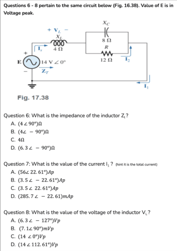

# quickz
Python library that helps with circuit calculations, designed for my Circuits I and Circuits II classes at RIT for use on the TI NSpire CX-CAS during exams.

> **Note**
> 
> Documentation will come soon once this module is stable and has plenty of features.

## Demo

In case you want to see a general idea of how the module works, here's some examples.

**These are from the exam review to demonstrate the power of `quickz`.**

### Phasor Math: Multiplying Phasors


```python
from quickz import *

Settings.auto_print_precision = True    # When printing values, automatically round to the global precision
Settings.precision = 3                  # By default, show 3 decimal place precision

phasor1 = Phasor("4.2 < 60")
phasor2 = Phasor("2.1 < 125")

answer = phasor1 * phasor2  # All types support most built-in Python math operators
print(f"Q3 ANSWER: {answer}")
```

```
Q3 ANSWER: 8.82 ∠ 185.0°
```

### Circuit Analysis: Voltage, Current, Impedance, etc

> [!IMPORTANT]
> Unit conversion for the `Phasor` class is still a work in progress.
> Until that is working properly, only base unit examples will be shown.

`quickz` can do circuit analysis. It can find the voltage of each component, do current calculations with Ohm's Law, and
a lot more. Check it out:



```python
from quickz import *

Settings.auto_eng = True                # Automatically convert values to engineering notation
Settings.auto_print_precision = True    # When printing values, automatically round to the global precision
Settings.precision = 3                  # By default, show 3 decimal place precision

# Define components that are known
V1 = Phasor("14 < 0")
L1 = L("4 Ω")
C1 = C("8 Ω")
R1 = R("12 Ω")

# /// QUESTION 6 ///
# Q6 just wants the value of L1, as it is given

# So, just print it, quickz automatically formats it to be human-readable
print(f"Q6 ANSWER = {L1}\n")

# /// QUESTION 7 ///
# Q7 wants the value of the current I1, which will be the total current
# When put in series, the current across all components will be the same

# Combine the resistor and capacitor, R1 and C1 respectively, into one component
P = parallel(R1, C1)
print(f"In parallel: {P}")

# Add the converted parallel component
Z_total = L1 + P
print(f"Total impedance: {Z_total}")

# Perform Ohm's Law to find total current in a series circuit
I1 = ohms_law(v=V1, z=Z_total)  # quickz automatically determines the formula based on the arguments
print(f"Q7 ANSWER = {I1}\n")

# /// QUESTION 8 ///
# Q8 wants the voltage of the inductor

# Use voltage divider
VL1 = Z_voltage_divider(z=L1, z_total=Z_total, v_total=V1)
print(f"Q8 ANSWER = {VL1}")
```

```
Q6 ANSWER = 4.0 ∠ 90.0°

In parallel: 6.656 ∠ -56.31°
Total impedance: 4.0 ∠ -22.62°
Q7 ANSWER = 3.5 ∠ 22.62°

Q8 ANSWER = 14.0 ∠ 112.62°
```

**Answers:**


**`quickz` got them all right!**
